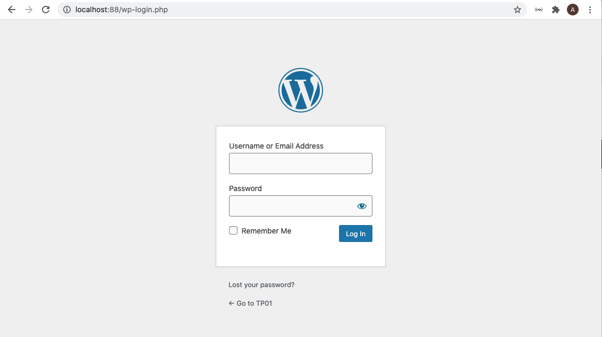
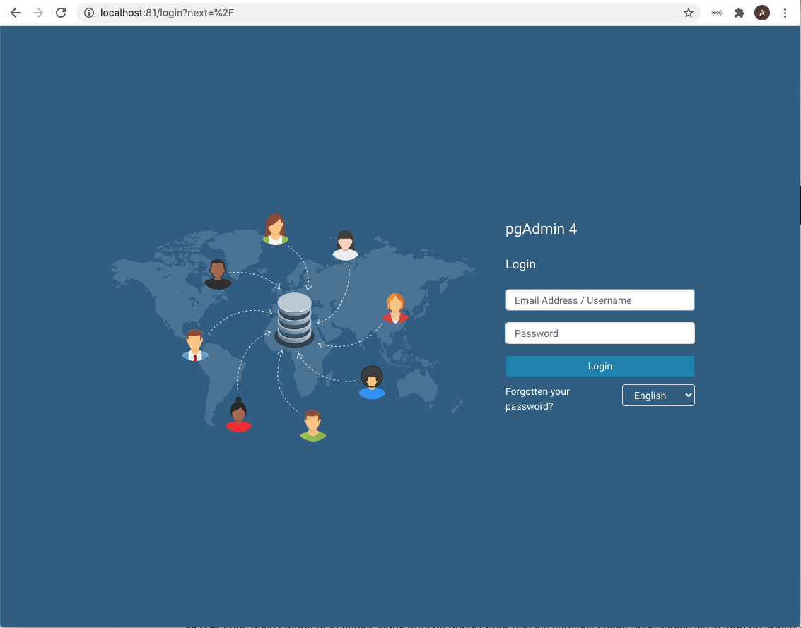
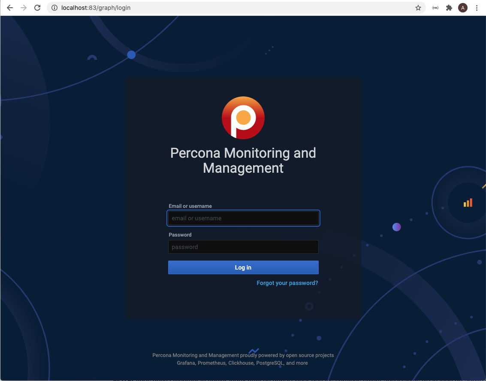
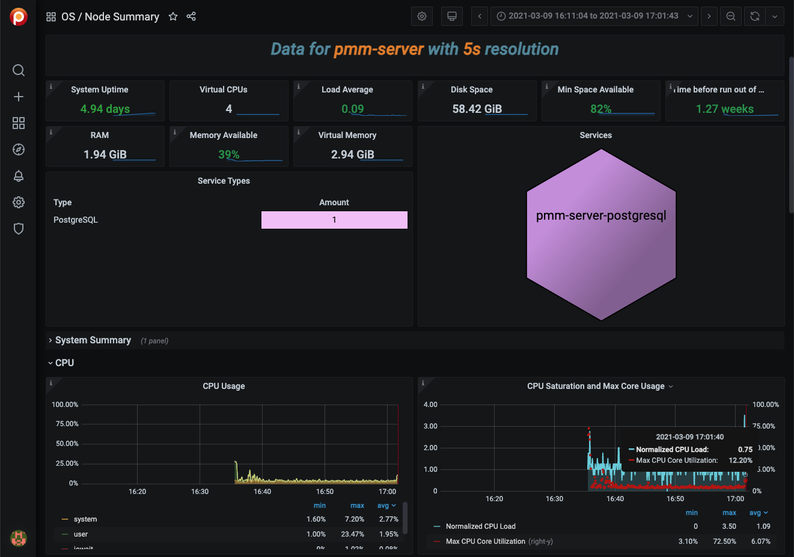

## Date de remise: Dimanche, le 28 mars 2021, 23h59 sur github, dans un projet >>>PRIVÉ<<<.
### Il faut m'inviter comme collaborateur (ve2cuy) et m'envoyer le lien du projet à aboudrea@cstj.qc.ca 
	NOTE: En clonant ce projet, vous obtiendrez les fichiers 
	et les dossiers de départ du travail pratique. 
	
	git clone https://github.com/ve2cuy/420-4D4.TP01.Depart

## ÉNONCÉ DU TRAVAIL PRATIQUE 01 - PONDÉRATION: 30% - Version préliminaire

### Il faut démarrer, avec *'docker-compose -d --build*', une application multi-services qui propose les services suivants

* (1) Le réseau privé: **reseauWP** offrant les services:
  * (1.1) **Serveur Web (nginx) principal** de l'application 
    * (1.1.0) Port **80**
    * (1.1.1) À partir du contenu du dossier 'contenu-web', de ce dépot Github, ainsi qu'une image personnalisée de *nginx*
      * (1.1.1.1) Il faut éditer le fichier *index.html* pour renseigner correctement les images et les liens du site web.
  * (1.2) Le SGBD **mariaDB**
    * (1.2.0) Port **3307**
    * (1.2.1) Les données des BD de *mariaDB* doivent-être stockées dans le dossier local '**bdwp**'
  * (1.3) Le service **wordpress**
    * (1.3.0) Port **88**
    * (1.3.1) L'image *wordpress* doit contenir le thème <a href="https://wordpress.org/themes/simple-style/">simple-style</a>
    * (1.3.2) L'image *wordpress* doit contenir le plugin <a href="https://wordpress.org/plugins/code-prettify/">code-prettify</a>
      * (1.3.1.1) Il faudra donc construire une image personnalisée de *wordpress* (docker build)
        * (1.3.1.1.1) Qui renseigne aussi le préfixe des tables à '**votreMatricule**' 
    * (1.3.3) <a href="https://docs.docker.com/compose/compose-file/compose-file-v3/#depends_on">Dépendance</a>:  "mariaDB"  
  * (1.4) Le service **phpmyadmin**
    * (1.4.0) Port **82**
    * (1.4.1) Dépendance:  "mariaDB"  

* (2) Le réseau privé: **reseauPMM** offrant les services:
  * (2.1) Le SGBD <a href="https://hub.docker.com/_/postgres">**postgreSQL**</a>
    * (2.1.0) Port **5432**
  * (2.2) Le service <a href="https://hub.docker.com/r/percona/pmm-server">**percona PMM Server**</a>
    * (2.2.0) Port **83**
    * () <a href="https://www.percona.com/doc/percona-monitoring-and-management/2.x/setting-up/server/index.html">Docum de percona</a> 
  * (2.3) Le service <a href="https://hub.docker.com/r/perconalab/pmm-client">**percona PMM client**</a> adapté au SGBD postgresSQL, dans le but d'obtenir des statistiques d'utilisation du SGBD via l'application 'percona PMM Server'.
    * (2.3.1) Dépendances:  "postgres", "pmm-server"  
  * (2.4) Le service <a href="https://hub.docker.com/r/dpage/pgadmin4">**postgresAdmin**</a>
    * (2.4.0) Port **81**  
    * (2.4.1) Dépendance:  "postgres"  

 * (3) Il faut **rédiger un fichier README.md** expliquant la démarche utilisée, recherches, expérimentations, ..., pour la mise en place du service ´**percona PMM Server** ainsi que le **client PMM** de type **postgreSQL**´.
 

### Construction des images personnalisées et démarrage des services de l'application:

	docker-compose up -d --build

**NOTE:** Pour '**docker build**' et '**docker-compose up -d --build**', il faut utiliser les noms par défaut.  C-A-D, '**Dockerfile**' et '**docker-compose.yml**'
 

### E1 - Écran principal de l'application - service nginx sur le port 80

**NOTE:** Vous devez modifier le fichier *index.html* de départ pour que les services soient accessibles via le logo de application.

### E2 - Écran principal du service wordpress - sur le port 88

### E3 - Écran principal du service postgressAdmin4 - sur le port 81

### E4 - Écran principal du service percona PMM Server - sur le port 83

### E5 - Écran du service percona PMM avec statistiques du SGBD prostgres

### E6 - Écran principal du service phpmyadmin - sur le port 82

 

### Voici la liste, obtenue avec docker-compose ps, des services:
	Name                      Command                  State                  Ports
 	-------------------------------------------------------------------------------------------------
 	TP01                  /docker-entrypoint.sh ngin ...   Up             0.0.0.0:80->80/tcp
 	mariabd               docker-entrypoint.sh mysqld      Up             0.0.0.0:3307->3306/tcp
 	pg-admin              /entrypoint.sh                   Up             443/tcp, 0.0.0.0:81->80/tcp
 	phpmyadmin            /docker-entrypoint.sh apac ...   Up             0.0.0.0:82->80/tcp
 	pmm-client-postgres   /entrypoint.py                   Up
 	postgres              docker-entrypoint.sh postgres    Up             0.0.0.0:5432->5432/tcp
 	serveur-pmm           /opt/entrypoint.sh               Up (healthy)   443/tcp, 0.0.0.0:83->80/tcp
 	wordpress             docker-entrypoint.sh apach ...   Up             0.0.0.0:88->80/tcp  
  
 

### Voici la liste des réseaux:
	NETWORK ID     NAME               DRIVER    SCOPE
	84da018281e3   bridge             bridge    local
	5b64d4b7c1d2   host               host      local
	786951a15a98   none               null      local
	21115657f748   reseauPMM          bridge    local
	c29c6df663c8   reseauWP           bridge    local

 

	NOTE: Il ne faut pas inscrire, dans le fichier 'docker-compose.yml' 
	des informations sensibles comme par exemple, des noms d'utilisateurs
	ou des mots de passe.
	
Utiliser plutot le fichier <a href="https://docs.docker.com/compose/compose-file/compose-file-v3/#env_file">.env</a> pour créer des variables de substitution.

### Voici la liste des variables utilisées dans le fichier docker-compose.yml
	# perconalab/pmm-server
	PMM_USER=
	PMM_PASS=

	# Wordpress
	WP_HOST=
	WP_USER=
	WP_PASSWORD=
	WP_DB_NAME=

	# MariaDB : La base de données pour WP
	MYSQL_DATABASE=
	MYSQL_USER=
	MYSQL_PASSWORD=
	MYSQL_ROOT_PASSWORD=

	# PostgreSQL
	POSTGRES_USER=
	POSTGRES_PASSWORD=

	# postgresADMIN
	PGADMIN_DEFAULT_EMAIL=tp01@420-4d4.com
	PGADMIN_DEFAULT_PASSWORD=secret

### 'docker-compose up -d --build' donne ceci:
	√ TP01 % docker-compose up -d --build
	Creating network "reseauWP" with driver "bridge"
	Creating network "reseauPMM" with driver "bridge"
	Building web
	Step 1/2 : FROM nginx
	---> 35c43ace9216
	Step 2/2 : ...
	---> d0436aa72401

	Successfully built d0436aa72401
	Successfully tagged alainboudreault/tp01:latest
	Building wordpress
	Step 1/8 : FROM wordpress:latest
	---> bbd9ec4bf176
	Step 2/8 : COPY simple-style ...
	---> Using cache
	---> 1954caa67d52
	...
	Step 8/8 : ENV WORDPRESS_TABLE_PREFIX=wp_
	---> Using cache
	---> 35cdc0347f1b

	Successfully built 35cdc0347f1b
	Successfully tagged alainboudreault/wp:latest
	Creating mariabd             ... done
	Creating postgres    ... done
	Creating serveur-pmm ... done
	Creating pg-admin    ... done
	Creating TP01        ... done
	Creating pmm-client-postgres ... done
	Creating wordpress           ... done
	Creating phpmyadmin          ... done

### 'docker-compose down' donne ceci:
	√ TP01 % docker-compose down
	Stopping phpmyadmin          ... done
	Stopping wordpress           ... done
	Stopping pmm-client-postgres ... done
	Stopping mariabd             ... done
	Stopping TP01                ... done
	Stopping serveur-pmm         ... done
	Stopping postgres            ... done
	Stopping pg-admin            ... done
	Removing phpmyadmin          ... done
	Removing wordpress           ... done
	Removing pmm-client-postgres ... done
	Removing mariabd             ... done
	Removing TP01                ... done
	Removing serveur-pmm         ... done
	Removing postgres            ... done
	Removing pg-admin            ... done
	Removing network reseauWP
	Removing network reseauPMM

 

### Voici une vidéo de démonstration de l'application

## Grille de correction

| Étape | Description                                                                     | Poids |
|-------|---------------------------------------------------------------------------------|-------|
|   1   | reseauWP + services                                                             |  10   |
|   2   | reseauPMM + services                                                            |  17   |
|   3   | README.md                                                                       |  03   |
| Total | ------------------------------------------------------------------------------> |  30   |

**Note:** Il y aura plus de détails dans la grille de correction d'ici quelques jours.

Document rédigé par Alain Boudreault - version 2021.03.10.04
